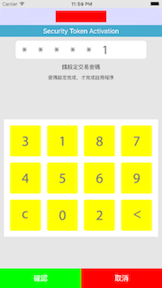

## 動態鍵盤

- 依據圖片 0~9 隨機排列
- 密碼輸入後，上方密碼框，自動屏蔽
- 確定密碼後，審核完畢，透過 delegate 回給父層

## code
```
	activityKeyViewController *temp  = [[activityKeyViewController alloc]init];
	temp.mainText = @"主要文字";
	temp.secondText = @"次要說明文字";
	temp.passWord = @"12345678";
	temp.errorTimes = 3;
    temp._delegate = self;
	[self presentViewController:temp animated:YES completion:nil];
```



## delegate

```
@protocol finishDelegate

-(void)AKV_finish:(NSString *)value;

@end
```